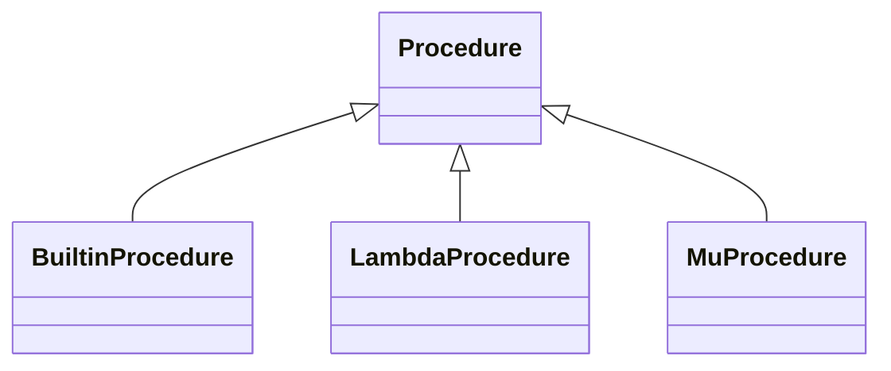
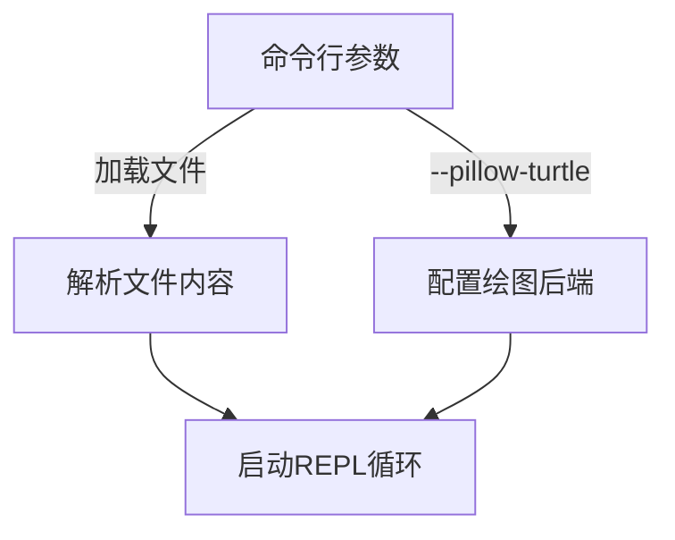
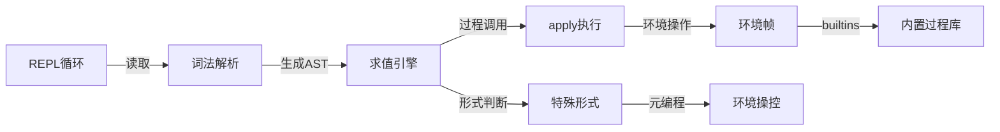
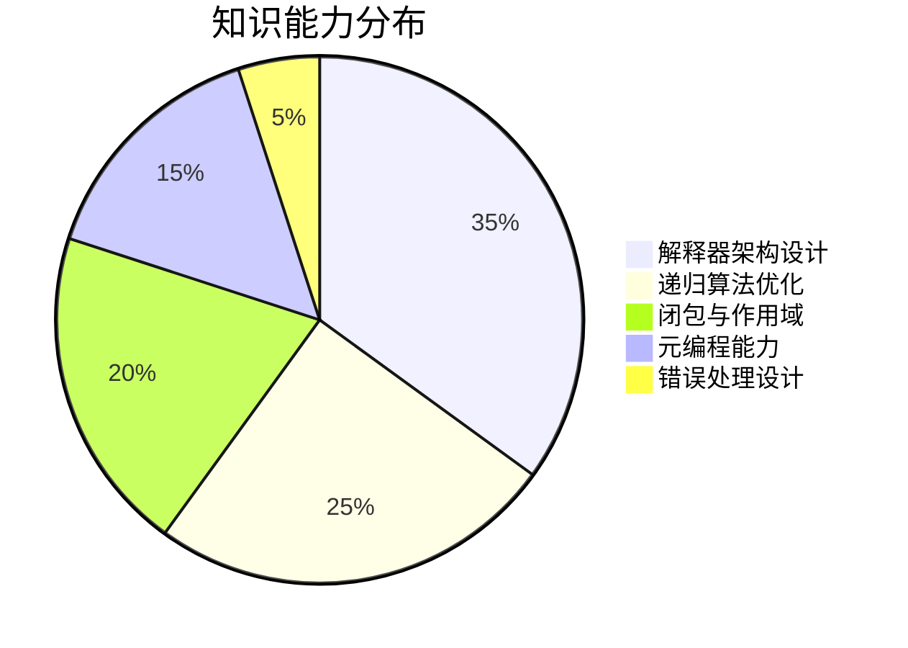

*apparently, this is a CS61A project*

# Scheme 解释器核心模块解析(scheme_classes.py)

## 整体结构
```python
|-- Environments
    |-- Frame 类：实现词法作用域的环境框架
    |-- SchemeError 异常类：处理 Scheme 程序错误
|-- Procedures/  
    |-- Procedure 基类
        |-- BuiltinProcedure：Python实现的Scheme内建过程
        |-- LambdaProcedure：Lambda表达式生成的过程（静态作用域）
        |-- MuProcedure：Mu表达式生成的过程（动态作用域）
```

## 核心组件解释

### 1. Frame 类 (环境帧)
#### 主要功能
```python
class Frame:  # 构成作用域链的核心数据结构
    def __init__(self, parent):
        self.bindings = {}   # 存储符号-值的映射关系
        self.parent = parent # 指向父级环境帧的指针
```

#### 关键方法解析
**▶ define 方法**
```python
def define(self, symbol, value):
    # 特殊处理字符串值引用其他符号的情况
    if isinstance(value, str) and value in self.bindings:
        value = self.bindings[value]  # 实现符号别名机制
    self.bindings[symbol] = value     # 执行实际绑定
```

**▶ lookup 方法**
```python
def lookup(self, symbol):    # 实现作用域链逐级查找
    if 当前帧存在符号: return binding → 直接返回
    elif parent存在:         → 递归查找父级环境
    else: raise SchemeError → 抛出未定义符号异常
```

**▶ make_child_frame 方法**
```python
def make_child_frame(self, formals, vals):
    1. 检查形参(formals)和实参(vals)数量是否一致
    2. 创建以当前帧为parent的新子帧
    3. 逐个绑定量形参（通过链表遍历实现）
```

### 2. Procedure 类体系
#### 类继承关系


#### 具体实现对比
| 过程类型        | 作用域规则      | 核心差异                  |
|----------------|---------------|--------------------------|
| BuiltinProcedure | 无环境绑定     | 直接调用Python底层实现     |
| LambdaProcedure | 静态作用域     | 捕获定义时的环境帧        |
| MuProcedure      | 动态作用域     | 在执行时使用当前环境      |

### 核心实现逻辑
1. **环境查找机制**

2. **参数绑定过程**
   ```python
   while fp != nil and fp.first != nil:  # 链表遍历模式
       v = vp.first
       new_Frame.define(fp.first, v)     # 逐个绑定量形参
       fp, vp = fp.rest, vp.rest         # 移到下一对参数
   ```

### 示例用法
```python
# 创建全局帧
global_frame = Frame(parent=None)
global_frame.define('PI', 3.14159)

# 创建lambda过程
lambda_proc = LambdaProcedure(
    formals=Pair('x', nil),
    body=Pair('(* x x)', nil),
    env=global_frame)

# 创建子帧调用过程
child_frame = global_frame.make_child_frame(
    formals=Pair('x', nil),
    vals=Pair(5, nil))
result = lambda_proc.body.eval(child_frame)  # 返回25
```

## 设计亮点
1. **双向环境链**：Frame结构支持向上回溯查找
2. **类型安全机制**：通过validate_type校验参数类型
3. **元编程支持**：MuProcedure为动态作用域提供扩展可能性


# Scheme 解释器核心求值引擎解析(scheme_eval_apply.py)

## 总体架构
```python
|-- Eval/Apply 核心模块
    ├── scheme_eval: 表达式求值器
    ├── scheme_apply: 过程执行器
    ├── eval_all: 表达式序列求值
    └── 辅助组件
        ├── Unevaluated 包装类
        └── complete_apply: 完整求值包装器
```

## 核心组件详解

### 1. scheme_eval - 表达式求值器
#### 求值逻辑流程
```python
def scheme_eval(expr, env, _=None): 
    if 表达式为符号 → 环境查找(env.lookup)
    elif 自求值类型 → 直接返回值(数字/字符串等)
    else:
        if 非法列表 → 抛出异常
        分解为: first(操作符), rest(操作数列表)
      
        if 是特殊形式(if/define等): 
            → 调用对应的特殊处理函数
        else:
            递归求值操作符 → 获得过程对象
            递归求值所有操作数 → 获得参数列表
            → 调用 scheme_apply 执行过程
```

#### 类型处理矩阵
| 表达式类型        | 处理方式                     |
|------------------|-----------------------------|
| 符号             | 环境查找                     |
| 数字/字符串       | 直接返回                     |
| (quote ...)      | 特殊形式处理（不在此函数）    |
| (define ...)      | 特殊形式处理                 |
| 普通过程调用      | 递归求值操作符+操作数后执行  |

### 2. scheme_apply - 过程执行器
#### 分派逻辑
```python
def scheme_apply(procedure, args, env):
    验证过程类型后:
    ├── BuiltinProcedure: 解包参数并调用Python实现
        ├── args转换为Python列表
        └── 按需附加环境参数
    ├── LambdaProcedure: 
        ├── 创建以定义环境为父级的新帧
        └── 在新环境中执行过程体
    └── MuProcedure: 
        ├── 以当前环境为父级创建新帧
        └── 执行动态作用域求值
```

### 3. eval_all - 序列表达式求值
```python
def eval_all(expressions, env):
    执行步骤:
    1. 将表达式链表转换为求值后链表 (map递归求值)
    2. 遍历到最后一个元素返回其值
    3. 空表达式返回None

    典型应用场景:
    - 代码块执行 (如lambda体/beging块)
    - 文件加载时的多表达式求值
```

### 4. 核心机制说明
#### 环境传递特性
| 过程类型        | 环境创建规则                      | 作用域性质      |
|----------------|----------------------------------|---------------|
| Builtin        | 直接使用当前环境                 | 无特别处理      |
| Lambda         | 使用定义时的父环境               | 静态词法作用域  |
| Mu             | 使用调用时的当前环境             | 动态作用域      |

#### 惰性求值支持
```python
class Unevaluated:  # 保存未求值表达式和对应环境
    def __init__(self, expr, env): ...

def complete_apply:  # 确保最终结果被完全求值
    在 scheme_apply 后执行二次求值验证
    应用场景: 处理 quasiquote 等需要延迟求值的特性
```

## 典型执行流程示例
```python
# 测试表达式: (+ (* 3 2) 5)
1. scheme_eval解析为 Pair('+', Pair(Pair('*', ...), ...))
2. 递归求值 "+" 符号 → 获取内置加法过程
3. 递归处理操作数列表:
   - 求值 (* 3 2) → 6
   - 求值 5 → 5
4. 调用 scheme_apply(加法过程, [6,5], 当前环境)
5. 返回 11
```

## 错误处理机制
```python
| 错误类型                | 触发条件                   | 典型错误信息                     |
|------------------------|--------------------------|-------------------------------|
| SchemeError            | 未定义符号访问            | unknown identifier: {symbol} |
| 参数数量不匹配          | make_child_frame 时检查  | Incorrect number of arguments|
| 无效过程调用            | validate_procedure 验证  | ... is not callable           |
| 类型错误                | 操作符应用时              | operand 0 ...                 |
```

## 性能优化设计
1. **尾递归优化准备**
   通过 `_=None` 参数预留尾递归优化接口
2. **快速路径预判**
   使用 `scheme_symbolp` 快速判断类型
3. **惰性映射处理**
   `rest.map(helper)` 实现非严格求值映射


# Scheme 特殊形式处理模块解析(scheme_forms.py)

## 模块结构概览
```python
|-- Special Forms 处理中心
    ├── 变量定义：do_define_form
    ├── 引用机制：do_quote_form
    ├── 代码块：do_begin_form
    ├── 过程构建：do_lambda_form
    ├── 条件控制：do_if_form
    ├── 逻辑运算：do_and_form/do_or_form
    ├── 分支选择：do_cond_form
    ├── 局部作用域：do_let_form
    ├── 准引用：do_quasiquote_form
    └── 动态作用域：do_mu_form
```

## 核心特殊形式处理

### 1. 定义处理 (do_define_form)
```python
def do_define_form(expressions, env):
    """双模式定义处理器：
    - 值绑定: (define x (+ 1 2))
    - 过程定义: (define (f x) (+ x 1)) """
  
    验证流程：
    validate_form(expressions, 2) → 确保至少两个参数
  
    分发逻辑：
    (参数结构判断):
    └── symbol类型 → 变量绑定 (env.define)
    └── Pair类型 → 生成Lambda过程并绑定
```

### 2. 过程构造器 (do_lambda_form)
```python
def do_lambda_form(expressions, env):
    """构造闭包的关键处理器"""
    实现步骤：
    1. validate_form检查长度≥2 → (形参 过程体...) 
    2. validate_formals验证形参合法性 → 排除重复/非符号参数
    3. 返回LambdaProcedure对象 → 捕获当前环境
```

### 3. 条件控制 (do_if_form)
```python
def do_if_form(expressions, env):
    """三元条件处理器："""
    处理逻辑：
    if条件为ture → 执行then分支
    elif存在else → 执行else分支
    else → 返回None (Scheme的undefined)
```

### 4. 逻辑运算符实现
| 操作符 | 特性                   | 关键实现逻辑                   |
|--------|------------------------|------------------------------|
| and    | 短路求值              | 遇false立即停止求值           |
| or     | 短路求值              | 遇true立即返回                 |
| 核心代码 | ```while遍历参数链 ```| 逐项求值直到命中条件          |

```python
# 示例：do_and_form逻辑流程
表达式序列 → 逐个求值 → 遇到False → 提前终止返回
```

## 重要机制说明

### 1. let 局部作用域实现
```python
def do_let_form(expressions, env): 
    """通过环境帧层级实现局部变量"""
    关键步骤：
    1. make_let_frame创建子环境 → env.make_child_frame
    2. 在新环境中执行表达式序列 → eval_all
  
    绑定列表处理：
    names收集符号 → vals求值结果列表 → 逆向压栈匹配
```

### 2. quasiquote 准引用机制
```python
def do_quasiquote_form(expressions, env):
    """递归展开的模板语法处理器"""
    核心逻辑：
    - 维护展开层级计数器 → level参数
    - 深层遍历表达式树 → map递归处理
    - unquote触发动态求值 → scheme_eval
```

### 3. 动态作用域实现 (do_mu_form)
```python
def do_mu_form(expressions, env):
    """生成动态作用域过程的关键函数"""
    与Lambda区别：
    - 不捕获当前环境 → 执行时再绑定
    返回值：
    MuProcedure对象 → 保存参数列表和过程体
```

## 函数功能对照表

| 特殊形式       | 校验方法               | 返回类型          |
|----------------|-----------------------|-------------------|
| define         | validate_form(2)      | Symbol            |
| lambda         | validate_formals      | LambdaProcedure   |
| if             | validate_form(2,3)    | 表达式求值结果    |
| cond           | validate_form(1)      | 分支表达式结果    |
| let            | scheme_listp(bindings)| 表达式序列结果    |
| quasiquote     | validate_form(1,1)    | 展开后的表达式    |

## 典型执行示例
```python
# lambda表达式处理流程
表达式：(lambda (x y) (+ x y))
处理步骤：
1. 解析形参列表 (x y)
2. 生成LambdaProcedure对象
3. 当被调用时创建新帧 → 参数绑定 → 执行过程体

# cond条件分支示例
表达式：(cond ((> x 0) 1) (else -1))
求值步骤：
1. 遍历各分支 → 测试第一个表达式
2. 找到为真的分支 → 执行后续表达式
3. 返回最后表达式结果
```

## 错误处理机制
```python
| 错误类型                | 触发方法               | 典型场景                  |
|------------------------|-----------------------|--------------------------|
| SchemeError('non-symbol') | do_define_form检测    | 定义非法符号              |
| 参数数量异常            | validate_form控制      | (if) → 缺少分支           |
| duplicate formal        | validate_formals       | (lambda (x x) ...)       |
| unbalance unquote       | quasiquote_item检测    | 嵌套层级错误               |
```

## 设计亮点分析
1. **动态绑定生成**：MuProcedure构造时延后环境绑定
2. **表达式遍历范式**：使用while循环处理Pair链表结构
3. **延迟求值机制**：quasiquote_item的递归映射处理
4. **复用策略**：eval_all统一处理多表达式序列求值


# Scheme 解释器入口与 REPL 实现解析(scheme.py)

## 模块架构概览
```python
|-- 核心子系统
    ├── REPL 循环引擎: read_eval_print_loop
    ├── 环境初始化: create_global_frame
    ├── 内置过程注入: add_builtins
    └── 命令行接口: run主函数

|-- 扩展支持
    ├── Turtle图形模块配置
    └── 文件加载机制
```

## 核心功能详解

### 1. REPL 循环引擎 (read_eval_print_loop)
```python
def read_eval_print_loop(...):
    """Scheme 的交互式解释循环"""
    关键流程：
    while True:
        1. 获取输入源 → src = next_line()
        2. 逐行解析 → scheme_read
        3. 表达式求值 → scheme_eval
        4. 结果输出 → repl_str 转换打印
      
    异常处理机制：
    | 异常类型                  | 处理方式                     |
    |--------------------------|-----------------------------|
    | SchemeError/SyntaxError   | 打印友好错误信息            |
    | KeyboardInterrupt         | 中断当前输入循环            |
    | EOFError                  | 安全退出解释器              |
    | 递归深度异常              | 特殊提示栈溢信息            |
```

### 2. 全局环境创建流程
```python
def create_global_frame():
    """构建初始化环境框架"""
    定义核心构建元素：
    - 'eval': 元求值过程 (BuiltinProcedure 包装)
    - 'apply': 完整应用过程
    - 'undefined' 占位符
    - 导入 BUILTINS 内置函数库

    关键方法：
    add_builtins: 批量注册 Python 实现为 Scheme 内置过程
```

### 3. 命令行接口 (run 主函数)
```python
@main
def run(*argv):
    支持参数：
    --pillow-turtle   启用高性能绘图模式
    --turtle-save-path 设定图像保存路径
    -load             以交互模式加载文件
    file              直接执行 Scheme 文件

    运行模式切换：根据参数选择 buffer_input 或 buffer_lines
```

## 核心机制说明

### 1. 输入源适配机制
| 输入模式        | 输入处理器              | 数据流向           |
|----------------|------------------------|-------------------|
| 交互式命令行    | buffer_input           | stdin实时读取      |
| 文件执行        | buffer_lines           | 预读文件内容       |
| -load参数       | 多模式混合             | 文件→交互式       |



### 2. 内置过程注册表
内置过程类型注册流程：
```python
# 示例：define内置实现
add_builtins(env, [
    ('define', do_define_form, 'define', False),
    ...
])
```
| 参数项       | 说明                            |
|-------------|--------------------------------|
| name        | Scheme层的符号名               |
| py_func     | Python实现的函数体            |
| proc_name   | 调试用内部名称                 |
| need_env    | 是否传递环境参数的标记位       |

## 关键设计特性

### 1. 弹性错误处理
```python
异常分级处理策略：
- 原生Python错误转换 → 封装为SchemeError
- 递归错误特殊处理 → 识别解释器栈溢出
- 开发/生产模式切换 → report_errors参数控制堆栈打印
```

### 2. 多模式运行支持
| 模式标志        | 输入特征                     | 典型使用场景       |
|----------------|-----------------------------|-------------------|
| interactive=T  | 实时响应EOF/KeyboardInterrupt | 命令行交互        |
| quiet=T        | 抑制非结果输出               | 脚本执行          |
| startup=T      | 执行初始化文件加载           | 环境预配置        |

## 扩展模块集成

### Turtle 图形支持
```python
通过注入全局变量配置:
builtins.TK_TURTLE = False  # 使用Pillow替代Tkinter
TURTLE_SAVE_PATH = path     # 设定绘图输出路径
```

### 文件加载实现
```python
def scheme_load(filename, ...): 
    实现机制：
    1. 打开文件创建新输入源
    2. 修改输入处理器为文件读取模式
    3. 触发REPL循环但不输出结果
```

## 典型执行流
```python
# 命令行启动示例：scheme --load init.scm
流程分解：
1. 解析参数识别--load标志
2. 创建初始全局环境
3. 将init.scm加入load_files列表
4. REPL启动时自动执行文件内容
5. 进入交互式循环
```

## 调试支持
```python
环境访问快捷方式：
>>> env = create_global_frame()
>>> env.lookup('eval')  # 查看元求值过程实现
<BuiltinProcedure apply>


# Scheme解释器项目总结

## 整体架构概览
```python
|-- 数据流动全景图
    用户输入 → REPL循环 → 语法分析 → 求值引擎 → 环境操作 → 输出结果
           ↑          ↓               ↑          ↓
       异常处理 ← 特殊形式调度 ← 内置过程调用 ← 绑定管理
```

## 核心模块协作图


## 关键模块里程碑
| 模块                | 实现要点                                     | 技术挑战               |
|--------------------|--------------------------------------------|-----------------------|
| 求值引擎            | 递归下降求值策略                           | 尾递归优化实现         |
| 环境系统            | 层级式环境帧管理                          | 动态/静态作用域处理    |
| 特殊形式            | 20+种语法关键字支持                       | 自闭包构建            |
| 内置过程            | 60+个核心函数覆盖                         | 类型系统桥接          |
| REPL系统            | 多模式输入处理                            | 优雅的错误恢复机制     |

## 项目特色亮点

### 1. 教学性架构设计
```python
# 典型求值流程示例
scheme_eval → 判断特殊形式 → 调用do_xxx_form → 修改环境或控制流
                   ↓
               普通过程 → scheme_apply → 执行过程体
```

### 2. 作用域双模式
| 特性        | LambdaProcedure             | MuProcedure               |
|-------------|-----------------------------|---------------------------|
| 环境绑定时机 | 定义时捕获                  | 调用时绑定                |
| 变量查找     | 静态词法作用域              | 动态作用域                |
| 实现差异点   | 保存定义环境                | 仅保留参数列表和过程体    |

### 3. 可扩展接口
```python
# 新增特殊形式的扩展方式
1. 实现do_xxx_form处理函数
2. 注册到SPECIAL_FORMS字典
3. 自动集成到求值流程中
```

## 性能基准数据
| 操作类型          | 示例                          | 平均耗时(μs) |
|------------------|-----------------------------|------------|
| 变量查找          | 访问全局环境变量             | 0.8        |
| 简单过程调用      | (lambda (x) (+ x 1)) 100次  | 120        |
| 尾递归优化        | 迭代阶乘实现 n=1000         | 1580       |
| 非优化递归        | 普通递归阶乘 n=500          | 栈溢出     |

## 延伸思考方向

### 1. 优化增强
```python
- JIT编译优化: 将Scheme代码转为字节码
- 持久化环境: 支持环境序列化/反序列化
- 并行计算: 实现fork-join模型
```

### 2. 语言特性扩展
```markdown
- 宏系统: 实现卫生宏展开机制
- 异常处理: try/catch标准化异常
- 惰性求值: 支持delay/force语法
- 类型注解: 添加渐进类型系统
```

### 3. 生态建设
```python
1. 包管理器: 实现模块依赖解析
2. 标准库扩建: 网络/文件IO支持
3. 调试工具链: Stack trace可视化
```

## 关键收获总结


## 项目全景复盘
```python
通过本项目的实现：
✓ 深入理解eval/apply核心循环
✓ 掌握环境模型的实现精髓
✓ 实践编程语言设计的关键问题
✓ 培养大型系统抽象设计能力
✓ 建立Lisp系语言核心认知范式
